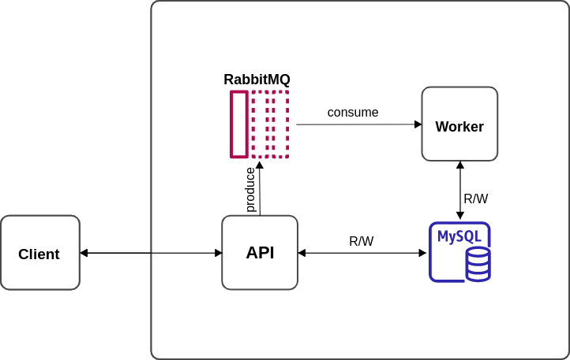

# MDS-Challenge
## Problem definition
One of the main challenges of building an ecommerce platform is to keep an accurate
list of products and their stocks up to date.
Based on that, we want to build a system that allows us to manage products for an
hypothetical ecommerce platform.

For this system a product should have an unique SKU and could be commercialized in
multiple countries. Each product can then have different stock per country.

Design and build a system that manages products and their stock with the following
requirements:

1. Provide a products API
   a. Get a product by SKU
   b. Consume stock from a product.
- Should validate if the stock requested is available first, and then
  decrease it.

2. Provide an API that allows a bulk update of orders from a CSV.
   a. For each CSV line, the stock update could be positive or negative
   b. If a product doesn’t exist, it should be created.

## Toolbox

| Category         | Tool                                                                                  | Usage                                        |
| :--------------- |:--------------------------------------------------------------------------------------|:---------------------------------------------|
| Base             | [GoLang](https://go.dev/)                                                             |                                              |
| Database         | [MySQL](https://www.mysql.com/)                                                       |                                              |
| Queueing         | [RabbitMQ](https://www.rabbitmq.com/)                                                 | Queuing/consuming Bulk actions requests      |
| Containerization | [Docker](https://www.docker.com/)                                                     | Base environment for the stack to run inside |
### High level diagram



### System tests
1. Create Product
```bash
   curl --location --request POST 'localhost:8080/api/v1/products' \
--header 'Content-Type: application/json' \
--data-raw '{
"name":"coffee",
"sku":"AABBSSWW",
"amount":200,
"country_code":"eg"
}'
```
2. Get Product by SKU
```bash
  curl --location --request GET 'localhost:8080/api/v1/products/AABBSSWW'
```
3. Update Product by SKU
```bash
  curl --location --request PUT 'localhost:8080/api/v1/products/AABBSSWW' \
--header 'Content-Type: application/json' \
--data-raw '{
    "name":"coffee machine",
    "country_code":"eg",
    "amount":250
}'
```
4. Get products
```bash
curl --location --request GET 'localhost:8080/api/v1/products?limit=10&page=2' \
--header 'Content-Type: application/json' \
--data-raw '{
    "name":"coffee machine",
    "country_code":"eg",
    "amount":250
}'
```
5. Bulk upload
```bash
curl --location --request POST 'localhost:8080/api/v1/bulk/orders' \
--form 'file=@"/path/to/file"'
```
6. Create Order
```bash
curl --location --request POST 'localhost:8080/api/v1/products/e920c573f128/orders' \
--header 'Content-Type: application/json' \
--data-raw '{
    "amount":-250,
    "country_code":"gh"
}'
```